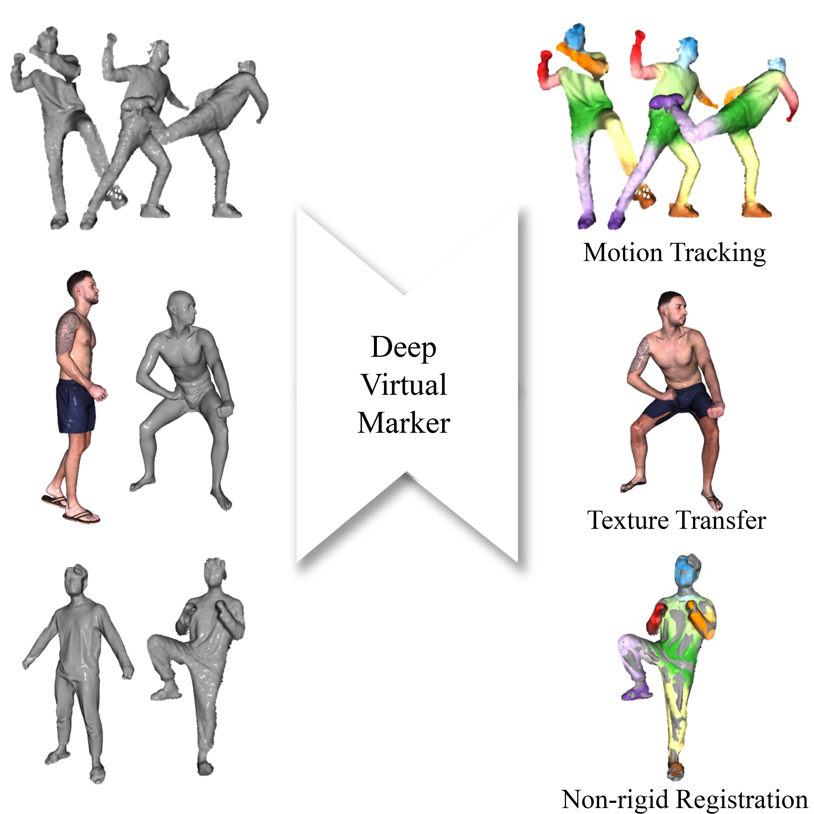
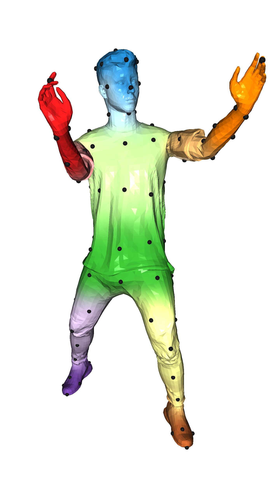
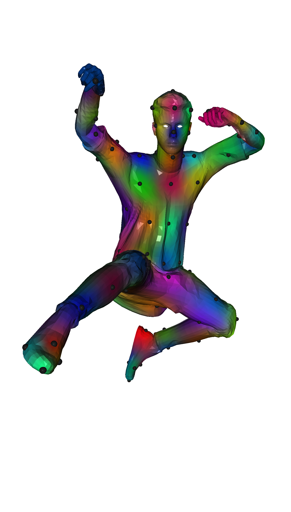
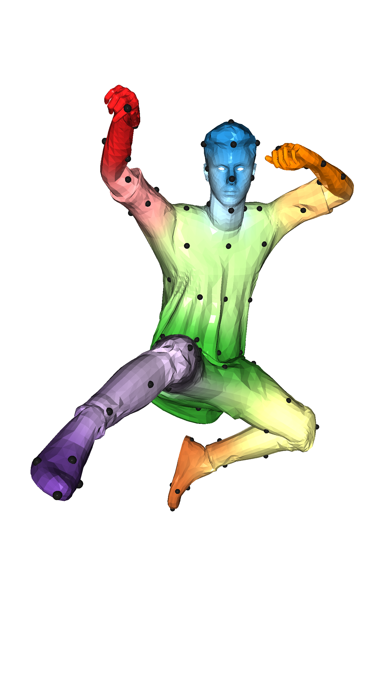
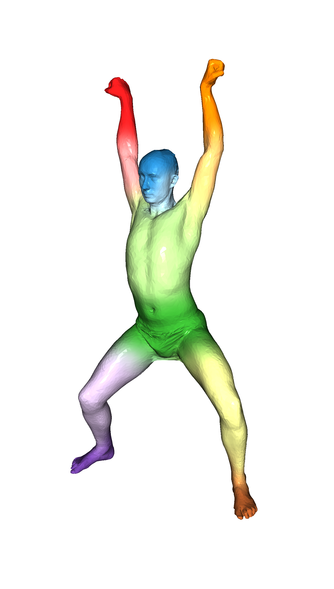
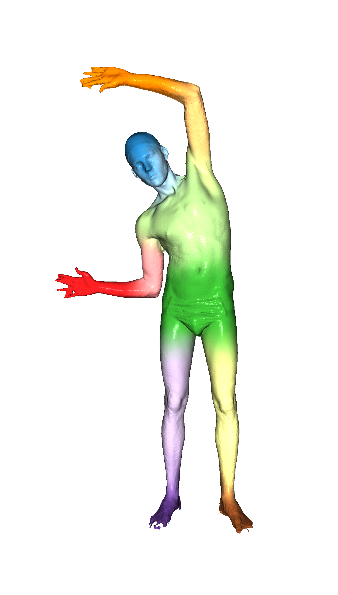
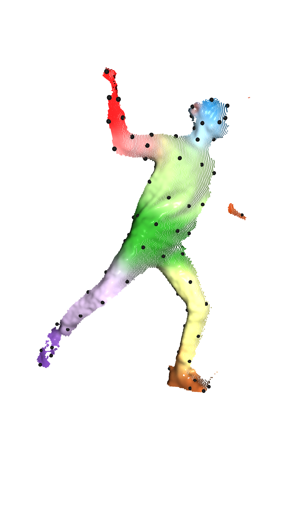

# Deep Virtual Markers

This repository contains the accompanying code for [Deep Virtual Markers for Articulated 3D Shapes, ICCV'21]()

<p align="center"> 

## Getting Started

Get sample data and weight from [here]()

### Simple Test (Docker)
```
docker pull min00001/cuglmink
./run_dvm_test.sh
```
     

<!-- ### Prerequisites

- Ubuntu 18.06 or higher
- CUDA 10.2 or higher
- pytorch 1.6 or higher
- python 3.8 or higher
- GCC 6 or higher

### Installing -->

## License

This project is licensed under the MIT License - see the [LICENSE](https://github.com/T2Kim/DeepVirtualMarkers/blob/main/LICENSE) file for details 

## Related projects

- [4D-SpatioTemporal ConvNets: Minkowski Convolutional Neural Networks, CVPR'19](https://github.com/chrischoy/SpatioTemporalSegmentation)
- [Minkowski Engine, a neural network library for sparse tensors](https://github.com/StanfordVL/MinkowskiEngine)
- [Fully Convolutional Geometric Features, ICCV'19, fast and accurate 3D features](https://github.com/chrischoy/FCGF)
